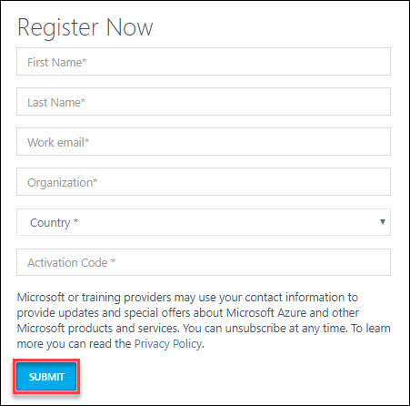

**Contents** 

<!-- TOC -->

- [CIE - Azure Migration hands-on lab step-by-step](#cie-azure-migration-hands-on-lab-step-by-step)
  - [Abstract and learning objectives](#abstract-and-learning-objectives)
  - [Overview](#overview)
  - [Solution architecture](#solution-architecture)
  - [Requirements](#requirements)
  - [Exercise 1: Sign Up for pre configured environment and verify subscription access](#exercise-1-sign-up-for-pre-configured-environment-and-verify-subscription-access)
    - [Help references](#help-references)
    - [Task 1: Sign Up for pre configured environment](#task-1-sign-up-for-pre-configured-environment)
    - [Task 2: Login to your Azure Portal and Verify access to the Subscription](#task-2-login-to-azure-portal-and-verify-access-to-the-subscription)
  

<!-- /TOC -->

### Exercise 1: Sign Up for pre configured environment and verify subscription access

In this exercise, you will create a source environment.
1.	**Navigate** to bitly link which was provided by instructor and register by providing all required information and **clicking** on **SUBMIT button**. 

<kbd></kbd>

2. Once registration is accepted, you will be automatically redirected to the lab details page. Now, it is advised to save a copy of the URL of lab details page in browser. **Click** on the **Launch Lab** button to start the lab. 

<kbd></kbd>

3. You will see the environment details soon below. 

<kbd></kbd>

Please ensure to take the values assigned to your deployment.
