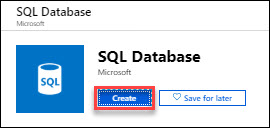
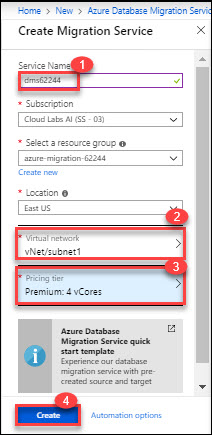

**Contents** 

<!-- TOC -->

- [CIE - Azure Migration hands-on lab step-by-step](#cie-azure-migration-hands-on-lab-step-by-step)
  - [Abstract and learning objectives](#abstract-and-learning-objectives)
  - [Overview](#overview)
  - [Solution architecture](#solution-architecture)
  - [Requirements](#requirements)
- [Exercise 1: Sign up for pre configured environment and verify subscription access](#exercise-1-sign-up-for-pre-configured-environment-and-verify-subscription-access)
  - [Task 1: Sign up for pre configured environment](#task-1-sign-up-for-pre-configured-environment)
  - [Task 2: Login to azure portal and verify access to the Subscription](#task-2-login-to-azure-portal-and-verify-access-to-the-subscription)
- [Exercise 2: Migrate SQL Server to Azure SQL Database Offline](#exercise-2-migrate-sql-server-to-azure-sql-database-offline)
  - [Help references](#help-references)
  - [Task 1: Create azure SQL database](#task-1-create-azure-sql-database)
  - [Task 2: Create azure database migration service](#task-2-create-azure-database-migration-service)
  - [Task 3: Run on-prem AdventureWorks2008R2 database assessment](#task-3-run-on-prem-adventureworks2008r2-database-assessment)
  - [Task 3: Migrate the sample schema](#task-3-migrate-the-sample-schema)
  - [Task 4: Create a migration project](#task-4-create-a-migration-project)
  - [Task 5: Specify source details](#task-5-specify-source-details)
  - [Task 6: Specify target details](#task-6-specify-target-details)
  - [Task 7: Run the migration](#task-7-run-the-migration)
 
<!-- /TOC -->

## Exercise 1: Sign up for pre configured environment and verify subscription access
**Duration:** 5 Minutes
In this exercise, you will create a source environment and verify the access on azure subscription.

### Task 1: Sign up for pre configured environment

Here, you will sign up for the lab.

1.	**Navigate** to bitly link which was provided by instructor and register by providing all required information with activation code and **clicking** on **SUBMIT button**. 
  

2. Once registration is accepted, you will be automatically redirected to the lab details page. Now, it is advised to save a copy of the URL of lab details page in browser. **Click** on the **Launch Lab** button to start the lab. 
  

3. You will see the environment details soon below. 
  

  Please ensure to take the values assigned to your deployment.
  
### Task 2: Login to azure portal and verify access to the subscription

In this task, you will log into the **Azure Portal** using your Azure credentials and you will verify the type of role you are assigned in this Subscription.
1. **Navigate** to https://portal.azure.com and login (from the previous step).
1. **Enter** the **Username** which was displayed in the previous window and **click** on **Next**. 
    
1. **Enter** the **Password** and click on **Sign in**. In the Stay signed in? pop-up window click on **Yes**.
    
1. Click on Resource Groups in left panel. You will see one Resource Group on which you have access. 
1. Click on **azure-migration-62244** Resource Group which contains the pre-deployed on-premises infrastructure.Here, 62244 is unique ID and it could be different.
   
   
## Exercise 2: Migrate SQL Server to Azure SQL Database Offline

In this exercise, you will deploy **SQL Database** and **Azure Database Migration Service**. After that you will validate and Migrate the **schema** of on-prem(SQL Server 2008 R2) AdventureWorks2008R2 database to Azure SQL Database using Database Migration Assistant. Then you will migrate **on-prem** offline **AdventureWorks2008R2** database to **Azure SQL Database** using Azure Migration Service of azure.

### Task 1: Create azure SQL database

1. Go to https://portal.azure.com and login with your azure credentials you got on lab details page.
1. Click on the **+Create a resource** icon in upper left corner and then search for **SQL Database** and select **SQL Database**. Feel the details and click on the **Review + Create** button  
   
1. Click on the **Create** button and provide the following details on Basic tab. 
   
   * Subscription: Click on drop down icon and then select the existing subscription.
   * Resource Group: Select existing RG, azure-migration-62244, here 62244 is unique id and could different for you.
   * Database Name: AdventureWorks2008R2
   * Server: Click on **Create new**, then provide the required details and click on **Select** button.
      * Server name: sqlserver62244, here replace 62244 with your unique ID i.e. sqlserver<uniqueID>
      * Server admin login: demouser
      * Password: demo@pass123
      * Location: East US, use the Resource Group location.  
      
   * Want to use SQL elastic pool: No
   * Compute + Storage: click Configure database. Set the below requirements and then click on **Apply** button.
     * Set the DTUs on **100**, PLease do not try with diffrent DTUs, It will be disallowed by policy during deployment.
     * Data Max size: 250 GB  
     
   * Click on the **Review + Create** button  
     
   * On Review + Create tab, review inputes which you gave and then, click on the **Create** button.  
       
     
### Task 2: Create azure database migration service

1. In Azure portal click on the **+Create a resource** icon in upper left corner and then search for **Azure Database Migration Service**. Then, select  **Azure Database Migration Service**.   
    
1. Click on create button.  
   
1. Provide valid inputes for Azure Database migration Service and then click on the create button.
   * Service Name: dms62244, Please use your unique id instead of 62244.
   * Subscription: Choose Existing.
   * Choose existing resource group
   * Location: East US, Select the Resource Group Location.
   * Virtual network: **vNet/subnet1**, choose existing vNet.
   * Pricing Tier: Premium: 4 vCores, premium is requred for online migration.  
   

### Task 3: Run on-prem AdventureWorks2008R2 database assessment

1. Go to https://portal.azure.com and login.
1. Click on the **azure-migration-62244** Resource Group and click on the sqlvm and login to the sqlvm with Public IP or SQL VM DNS name using RDP . You can also find sqlvm admin username, password and sqlvm dns name on lab details page.
   * Username: **demouser**
   * Password: **demo@pass123**
1. After login to sql vm. Click on the **SQL Server Management Studio(SSMS)** icon on taskbar.
   
1. When SSMS popup for connect to database, then click on **Connect** button by keeping default values. Please note the default sql server name(SQL2008R2-VM) to use it later.  
   
1. Now check and verify **AdventureWorks2008R2** database is preloaded in Object Explorer window.
   
1. Now, click on the **Data Migration Assistant(DMA)** icon on taskbar.
   
1. In this step, we will create new assessment project.
    * Click on the + icon to create new assessment project.  
      
    * Select **Assessment** in project type. Feel the values and click on **Create** button.
      * Project Name: **AzureDMSMigration**
      * Source server type: **SQL Server**
      * Target server type: Azure **SQL Database**  
        
    * Click on the **Next** button.  
      
    * Now enter the source server details and click on the **Connect** button.
      * Server name: **SQL2008R2-VM**
      * Authentication type: **Windows Authentication**
      * Check both connection properties **Encrypt connection** and **Trust server certificate**.  
        
    * Now, check the checkbox of **SQL2008R2-VM** and **AdventureWorks2008R2**. Then, click on the **Add** button i bottom right corner.  
      

   

      
    
     
    
      
    
   
  
